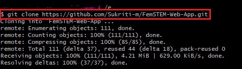

## Contribution Guidelines

We want to make contributing to this project as easy and as transparent as possible, whether it's: 

- Proposing new features

- Reporting a bug

- Submitting a fix

If you wish to contribute to this project, please raise an issue and wait for the project maintainers to approve it or give feedback before making a change.

This documentation contains a set of guidelines to help you during the contribution process. We are happy to welcome all the contributions from anyone willing to improve/add new scripts to this project.

## Code of Conduct

Make sure to read it here: [CODE_OF_CONDUCT.md](CODE_OF_CONDUCT.md)

## Preliminaries

- Download and install the latest stable version of [Git](https://git-scm.com/downloads) for version control
- Create a [Github](https://github.com/join) Account 
- Download and install latest stable version of [VS Code](https://code.visualstudio.com/download)
- Download and install latest stable version of [Node JS](https://nodejs.org/en/download/)

##   A. Setting up the Project

*1.*  Fork [this](https://github.com/Fem-STEM/FemSTEM-Web-App.git) repository by clicking on Fork button.  

  

*2.*  You can confirm that this repository is a fork of the original repository by finding the "forked from Fem-STEM/FemSTEM-Web-App" text under the repository name.

*3.*  Open git bash in the folder where you wish to work on the project and clone your forked copy of the project by typing the command given below in git. 

`git clone https://github.com/<your_username>/FemSTEM-Web-App.git` 

*4.* Navigate to the project directory by typing the following command.

`cd FemSTEM-Web-App/`

*5.* Add a reference to the original repository.

`git remote add upstream https://github.com/<your_username>/FemSTEM-Web-App.git`

*6.* Check the remotes for this repository.

`git remote -v`

*7.* Always take a pull from the upstream repository to your main branch to keep it at par with the main project(updated repository).

`git pull upstream main`

*8.* Then, run the following command in prompt.

`npm i` 

*9.* Then, run the following command in prompt.

`node app.js  or npm start`

*10.* The app must be running on `localhost:3000` on your system.

##  B. Contributing to the Project

- Once the project maintainer(s)/mentor(s) have reviewed the issue/assigned you the issue. Start working on the changes.

*1.* Create a new branch (DO NOT name it MAIN or MASTER or anything random).

`git checkout -b <your_branch_name>`

*2.* Perfom your desired changes to the code base.
- Make sure that you do not change any code unrelated to the task that you have been assigned

- Ensure that your changes apply to all screensizes

- Comment any new code addition(s)

- Do not mess up the directory structure

- Preview your changes and test them properly before proceding ahead

- Make a small clip or take screenshots before and after making changes.

*3.* Track your changes:heavy_check_mark: 

`git add .` 

*4.* Commit your changes.

`git commit -m "Relevant message"  (usually title of the pull request)`

- *Make sure to condense your changes into a single commit*.

*5.* Push the committed changes in your feature branch to your remote repo.

`git push -u origin <your_branch_name>`

*6.* To create a pull request, click on `compare and pull requests`. Please ensure you compare your feature branch to the desired branch of the repo you are suppose to make a PR to.

*7.* Then add an appropriate title and description to your pull request that explains your changes and efforts done.

*8.* Click on `Create Pull Request`.

> ### Guidelines for raising a pull request:
>
> - Each pull request should have an appropriate and short title like "Fixed Bug in Experience Page"
>
> - In case of multiple commits, please perform a rebase and make a squash commit before giving the pull request.
>
> - Pull Requests without a description would often not be reviewed. Make sure you describe your intended changes in the description section of the pull request. (Use bullet points and phrases)
>
> - Make sure to refer the respective issue in the respective PR using phrases like `Resolves #issue_number` or `Closes #issue_number`.

*9.* Voila :exclamation: You have made a PR. Sit back patiently and relax while the project maintainers review your PR. Please understand at times the time can vary from a few hours to a few days.